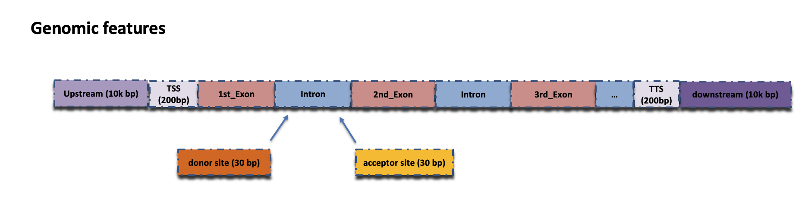
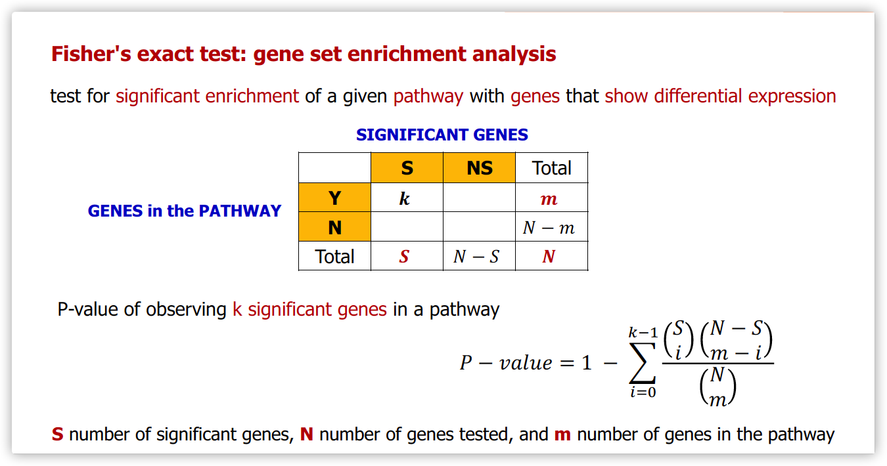

<!-- README.md is generated from README.Rmd. Please edit that file -->

 &nbsp;

[](https://opensource.org/licenses/MIT)
[](https://python.org/)
[](https://docs.djangoproject.com/en/4.1/releases/3.2.15/)
[](https://getbootstrap.com/docs/5.0/getting-started/introduction/)


## Table of Contents

<h1></h1>

- [About EnrichKit](#about-enrichkit)
- [Functions and Usage](#functions-and-usage)
  - [ID Conversion](#id-conversion)
  - [Genomic Coordinates Matching](#genomic-coordinates-matching)
  - [P-value Aggregation (nucleotide to gene)](#p-value-aggregation)
  - [Over-Representation Analysis](#over-representation-analysis)
  - [Gene Set Enrichment Analysis](#gene-set-enrichment-analysis)
- [Data Source](#data-source)
  - [Genome Annotation](#genome-annotation)
  - [Gene ID Information](#gene-id-information)
  - [Gene Ontology](#gene-ontology)
  - [Interpro](#interpro)
  - [KEGG](#kegg)
  - [Reactome](#reactome)
  - [MeSH](#mesh)
- [Contacts](#contacts)

## About EnrichKit

The goal of EnrichKit is to provide user-friendly functions to facilitate genomics research in livestock species. All the data are obtained from public biological databases. EnrichKit web server is currently available at http://enrichkit.info/.

Currently, we support 6 common livestock species. See [Data Source](#data-source)

Previously, EnrichKit was known in the form of [R package](https://github.com/liulihe954/EnrichKit). In this release (web server), it provides more functions and resources.

## Functions and Usage

Currently, there are three functions available.

### ID Conversion

Genomics/genetics analysis often need to process lists of genes arising from various studies, where database-specific identifiers (IDs) are commonly used to uniquely refer to each gene. However, the correspondence (of the same gene entity) between different databases are sometimes incomplete and/or out-dated due to various reasons. In order to better integrate information from multiple sources/databases, a stable and convenient ID conversion tool that based on the most up-to-date data is necessary.

Here we developed a web ID conversion service that relies on Ensembl as a primary data source, and regularly updates the correspondence between Ensembl ([Ensembl ID](https://uswest.ensembl.org/info/genome/stable_ids/index.html)), NCBI ([Entrez ID](https://www.ncbi.nlm.nih.gov/pmc/articles/PMC1761442/#:~:text=Entrez%20Gene%20provides%20unique%20integer,E%2DUtilities%20(1).)), Vertebrate Gene Nomenclature Committee ([VGNC](https://vertebrate.genenames.org/tools/search/#!/genes)) and HUGO Gene Nomenclature Committee ([HGNC](https://www.genenames.org/tools/search/#!/?query=&rows=20&start=0&filter=document_type:gene); if orthologs exist). See [Data Source](#data-source)

To use the tool, users are required to format the input as one single column, one ID (either Ensembl ID or Entrez ID) per line, no separator between lines, for example:

```
ENSBTAG00000006374
ENSBTAG00000016357
ENSBTAG00000017894
ENSBTAG00000030258
```

The returned results will have 8 columns:

- Ensembl Id: the input Ensembl ID column
- Ensembl Symbol: the gene symbol present on Ensembl side
- NCBI Symbol: the gene symbol present on NCBI side
- Entrez ID: the corresponding Entrez ID (NCBI side)
- VGNC Symbol: the gene symbol provided by VGNC
- Human Orthologous: the human homologous gene ID (Ensembl ID)
- Human Entrez ID: the corresponding Entrez ID (NCBI side)
- HGNC Symbol: the gene symbol provided by HGNC

Note an empty field indicates missing/non-existing data.

### Genomic coordinates matching

In multi-omics studies, the signals based on genomic coordinates often need to be mapped to a proximal gene and/or annotated gene feature in order to better understand gene expression regulation. For example, DNA methylation events (various types of Methyl-seq), chromatin accessibility measurement (DNase-seq or ATAC-seq) and TF binding or histone modifications events (ChIP-seq). 

Here, we provide such funtion that can match a given genomic coordinate (chromosome + target position) to gene feature(s). The following model is used to define gene features.

 &nbsp;

- Upstream: intergenic region upstream/adjacent of the first exon (default length 10k bp)
- TSS (transcription starting site): intergenic region upstream/adjacent of the first exon (default length 200 bp)
- Exon: exons defined in genome annotation
- Intron: region between two consecutive exons
- Splice donor site: the front portion of an intron (from 5' to 3'; default length 30 bp)
- Splice acceptor site : the tail portion of an intron (from 5' to 3'; default length 30 bp)
- TTS (transcription termination site): intergenic region downstream/adjacent of the last exon (default length 200 bp)
- Downstream: intergenic region downstream/adjacent of the last exon (default length 10k bp)

To use the tool, users are required to format the input as one single column, one coordinate per line, no separator between lines; each coordinate should have a chromosome number and a target position, for example:

```
1:140285514
1:141079656
1:143579389
1:145417374
```

The returned results will have 8 columns:

- Input Chromosome: chromosome number
- Input Position: base pair count
- Feature type: current feature type
- Feature name: current feature name
- Transcript: if the matched feature is exonic region, this column shows the corresponding transcript ID
- Gene ID: the associated Gene ID (Ensembl ID)
- Gene Biotype: the biotype recorded in Ensembl annotation
- Gene Strand: gene strand

Note, if the current position failed to match any feature, "intergeneric or out of bound" will show up.

### P-value Aggregation (nucleotide to gene)
The goal of P-value aggregation is to combine a set of nucleotide-level signals to generate an single aggregated P-value for a proximal gene (within or near). Note we assume that the P-values P<sub>i</sub> are independent and uniformly distributed under their null hypotheses although the independence assumption may be violated because of linkage disequilibrium, for example, multiple SNPs in a single gene.

There are currently four methods available.

- [Fisher's combination test](https://docs.scipy.org/doc/scipy/reference/generated/scipy.stats.combine_pvalues.html)
- [Sidak's combination test (the best SNP)](https://www.statsmodels.org/dev/generated/statsmodels.stats.multitest.multipletests.html)
- [Simes' combination test](https://rdrr.io/cran/mppa/man/simes.test.html)
- [The FDR method](https://www.statsmodels.org/dev/generated/statsmodels.stats.multitest.multipletests.html)

Users can choose to apply multiple methods (extra methods will yield extra columns in the output).


### Over-representation Analysis

Over-representation analysis is an intuitive statistical method using Fisher’s exact test that determines whether genes from pre-defined sets are present more than expected (test of proportions based on the hypergeometric distribution) in a subset (significant gene) of full gene list (total gene). Significant genes could be derived from differentially expressed genes, genes flagged by significant SNPs from whole-genome scans, genes in non-preserved co-expression modules, etc..

 &nbsp;

Five pathway/annotation databases are currently integrated - Gene Ontology (GO), Interpro, KEGG, Reactome and Medical Subject Headings (MeSH). See [Data Source](#data-source)

To use this tool, users are required to format the input as two columns, separated by a comma; the first column has Gene ID (Ensembl ID), the second column has 0 (for non-significant gene) or 1 (for significant gene); no separator between lines; for example:

```
ENSBTAG00000050840,1
ENSBTAG00000037673,1
ENSBTAG00000050062,1
ENSBTAG00000053051,1
ENSBTAG00000001781,1
ENSBTAG00000012599,1
ENSBTAG00000018202,0
ENSBTAG00000007484,0
ENSBTAG00000009579,0
ENSBTAG00000049408,0
ENSBTAG00000046569,0
```

Note, all genes in this list will be considered as **total/background gene** and those followed by "1" will be considered as **significant gene**.

The returned results will have 8 columns:

- Term: term ID and annotation/explanations.
- totalG: **_m_** (number of total genes in the pathway)
- sigG: **_k_** (number of significant genes in the pathway)
- pvalue: Pvalue of Fisher’s exact test
- ExternalLoss_total: number of total genes **NOT** annotated in
  the database
- ExternalLoss_sig: number of significant genes **NOT** annotated
  in the database
- findG: enumerating **k**, significant genes found in the pathway
- hitsPerc: **k/m**, percentage of significant genes
<!-- - **adj.pvalue**: adjusted Pvalue (multiple testing correction) -->

### Gene Set Enrichment Analysis
Gene Set Enrichment Analysis (GSEA) is performed using the [gseapy](https://gseapy.readthedocs.io/en/latest/introduction.html) framework with livestock pathways (see [Data Source](#data-source)).

The output format largely inherits gseapy output [format](https://gseapy.readthedocs.io/en/latest/run.html).
- Term ID: pathway/term ID
- Source: the source database name
- Term Description: pathway/term description
- ES: enrichment score
- NES: normalized enrichment score
- P value: nominal p-value (from the null distribution of the gene set
- FDR: FDR qvalue (adjusted False Discory Rate)
- FWERP: Family wise error rate p-values
- TAG%: percent of gene set before running enrichment peak (ES),
- Gene%: Percent of gene list before running enrichment peak (ES)
- Lead Genes: leading edge genes (gene hits before running enrichment peak)
- Matched Genes: genes matched to the data

## Data Source

Please refer to our [data pipeline](https://github.com/liulihe954/EnrichKitDB) for details of downloading, parsing and migrating datasets.

### Genome Annotation

Gene annotation are directly downloaded from [Ensembl FTP site](http://ftp.ensembl.org/pub/release-107/gtf/).

- [Cow - Bos_taurus.ARS-UCD1.2](http://ftp.ensembl.org/pub/release-107/gtf/bos_taurus/Bos_taurus.ARS-UCD1.2.107.gtf.gz)
- [Goat - Capra_hircus.ARS1](http://ftp.ensembl.org/pub/release-107/gtf/capra_hircus/Capra_hircus.ARS1.107.gtf.gz)
- [Sheep - Ovis_aries.Oar_v3.1](http://ftp.ensembl.org/pub/release-107/gtf/ovis_aries/Ovis_aries.Oar_v3.1.107.gtf.gz)
- [Chicken - Gallus_gallus_gca000002315v5.GRCg6a](http://ftp.ensembl.org/pub/release-107/gtf/gallus_gallus_gca000002315v5/Gallus_gallus_gca000002315v5.GRCg6a.107.gtf.gz)
- [Pig - Sus_scrofa.Sscrofa11.1](http://ftp.ensembl.org/pub/release-107/gtf/sus_scrofa/Sus_scrofa.Sscrofa11.1.107.gtf.gz)
- [Horse - Equus_caballus.EquCab3.0](http://ftp.ensembl.org/pub/release-107/gtf/equus_caballus/Equus_caballus.EquCab3.0.107.gtf.gz)

### Gene ID Information

All Gene ID correspondences are obtained from public databases via FTP download, REST APT and/or web scraping.

Specifically,

- Match Ensembl ID to Entrez ID: [NCBI FTP site - gene2ensembl.gz](http://ftp.ncbi.nih.gov/gene/DATA/gene2ensembl.gz)
- Match Entrez ID to NCBI gene symbol: [NCBI FTP site - gene_info.gz](http://ftp.ncbi.nih.gov/gene/DATA/gene_info.gz)
- Match Ensembl ID to official VGNC gene symbol: [VGNC FPT site](http://ftp.ebi.ac.uk/pub/databases/genenames/vgnc/tsv/all/locus_groups/all_protein-coding_gene_All.txt)
- Retrieve Human Orthologs: [HGNC FTP site](http://ftp.ebi.ac.uk/pub/databases/genenames/hgnc/tsv/locus_groups/protein-coding_gene.txt)

After joining data from the above sources, [Ensembl REST API](https://rest.ensembl.org/) and [Python3 requests module](https://pypi.org/project/requests/) were used to double-check and/or complement the missing fields.

### Gene Ontology

- [Ensembl Biomart service](http://uswest.ensembl.org/biomart/martview/fc61452faf168c61df7ebe54648df308) was used to retrieve a full list of [Gene Ontology](https://uswest.ensembl.org/Help/View?id=285#:~:text=The%20Gene%20Ontology%20tables%20show,to%20genes%20via%20UniProt%20mappings.) terms and genes involved in each of the term.

### Interpro

- [Ensembl Biomart service](http://uswest.ensembl.org/biomart/martview/fc61452faf168c61df7ebe54648df308) was used to retrieve a full list of [Interpro](https://www.ebi.ac.uk/interpro/) terms and genes involved in each of the term.

### KEGG

- [KEGG API](https://www.kegg.jp/kegg/rest/keggapi.html) was used to retrieve a full list of KEGG pathways and genes involved in each pathway. Specifically, `/link/pathway/species` was used to retrieve KEGG pathways linked from each of the genes of a species, `/list/pathway/species` returns the list of pathways of a species.

### Reactome

- On the [Reactome download page](), the [NCBI to All pathways](https://reactome.org/download/current/NCBI2Reactome_All_Levels.txt) category was used.

### MeSH

- The Bioconductor [AnnotationHub](https://bioconductor.org/packages/release/bioc/html/AnnotationHub.html) provides MeSH dababase.

## Contacts

EnrichKit is developed by the [Quantitative Genomics & Computational Biology lab](http://fpenagaricano-lab.org/) at the [Department of Animal and Dairy Sciences](https://andysci.wisc.edu/), University of Wisconsin - Madison.
